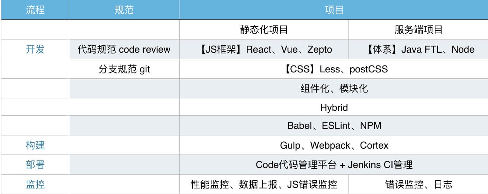

#美团点评平台前端技术体系

本文简要地介绍下美团点评平台研发一部前端目前所使用的主要技术栈和相关环节的工具。

**!声明**：考虑到安全性因素，相关链接有可能只能在公司内部才能打开

> 文中使用的「MUST」,「RECOMMENDED」,和「OPTIONAL」标注是用来描述技术的重要性和优先级，个人建议，仅供参考。

## 技术体系图

##技术工具栈

在开始开发前端项目之前，我们首先要确定项目类型，这会影响到JS框架的选型。

* 静态化项目

  特点：HTML页面通过CDN承载，页面动态数据完全通过前端的AJAX技术获取并渲染。
  
  * 单页应用SPA
  
  页面只有一个入口，前端完成页面的路由和动态更新，此时一般需要相应的前端框架解决项目的开发效率和可维护性，主要有React、Vue。
  
  > 新人可以与导师沟通确定你所在小组使用的JS框架，并有针对性的学习。
  
  * 多页应用
  
  相对SPA，每个页面独立承担各自的功能实现，工程复杂度减低，同时也比较利于不同页面的分享和传播。此时技术选型可继续使用React、Vue，也可使用Zepto（PC端使用JQuery），有页面的功能和复杂度所决定

* 服务端项目

  有服务端直接输出HTML页面，模板层目前主要有Java FTL模板 和 Node EJS模板。
  
> 服务端项目是相对比较传统的开发方式，目前团队内部主要项目都在使用静态化的方式开发。
  
### 开发篇

#### JavaScript

@MUST

框架的选项根据之前提到的项目选型而决定，要有`模块化`的开发思想，使用React、Vue等MV框架开发同时要关注`组件化`的开发思想
  
* 熟练的使用ES5语法以及JS的DOM相关操作
* 了解ES6的主要语法，可参考[ECMAScript 6入门](http://es6.ruanyifeng.com/)  
  
#### CSS框架

@MUST

* 了解以及熟练使用CSS，包括CSS3的相关属性（[flex布局](https://css-tricks.com/snippets/css/a-guide-to-flexbox/)等其他主要特性)
* 开发中主要使用LESS作为预处理语言，postCSS作为后处理工具。 CSS开发应尽可能的组件化或模块化，使后续的维护更加高效。

#### Hybrid

@RECOMMENDED

如果你对hybrid不够了解，可以参考[Infoq的hybrid介绍](http://www.infoq.com/cn/articles/hybrid-app-development-combat)。

当你的页面需要内嵌在美团点评的各个app时，可以通过使用hybrid方式扩展JS的功能，目前我们公司层面统一了hybrid框架，统一使用KNB库[KNB](http://docs.sankuai.com/doc/knb/knb-doc/api/)

#### 包管理

@RECOMMENDED

* npm包管理，目前主流采用的包管理机制，当然我们有自己内部的[私有仓库](http://npm.sankuai.com/)
* cortex包管理，和cortex打包机制相对应，在一些老项目中还需要继续使用和维护。cortex相关概念可参考[cortex github文档](http://book.ctx.io/zh-cn/index.html)

#### 代码管理

@RECOMMENDED

* ES6代码在浏览器端需要通过babel转成ES5，可查看[babel-官网](https://babeljs.io/)
* 代码风格通过ESLint进行控制，详情查看[ESLint-官网](http://eslint.org/)

#### 开发规范

@MUST

* 熟练使用[Git](https://git-scm.com/)代码管理工具，了解分支概念，新人须在自己分支开发代码，测试完成后向你的导师pull request申请合并到主分支
* 导师对pull request代码进行code review，帮助新人规范代码

#### 调试篇

@MUST

代码开发完成后，总会出现与预期有出入的BUG，这要求我们有基本的调试技巧和周边知识体系

* 对HTTP要有基本的了解
* 了解如何利用chrome的开发者工具进行调试
* 手机端的调试

### 构建篇

@RECOMMENDED

* 熟练使用和配置[Gulp](https://github.com/gulpjs/gulp/blob/master/docs/getting-started.md)作为自动化构建的工具
* 使用[Webpack](https://webpack.github.io/)作为打包工具
* cortex构建，可参考上面包管理中的cortex文档

### 部署篇

@OPTIONAL

* 代码统一通过Code平台管理（Gitlab在公司内部的实现）
* Jenkin CI与Code集成，由CI在远程机器上构建并发布项目

### 监控篇

@OPTIONAL

* 前端监控：主要关心页面的性能Perfermance，业务功能的打点数据上报(hippo组件)、JS错误监控
* 后端监控：错误上报到cat平台，同时通过日志文件记录其他信息